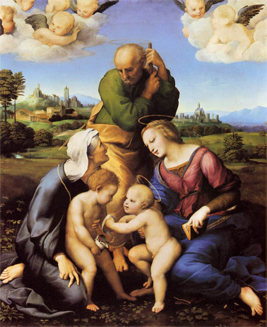

If you are a man with the right amount of poetry in your heart, you get astonished looking at renaissance picture from great artists like Michelangelo, Perugino and Botticelli. But what makes their paintings so beauty? 

Is the great dominance they show of drawing and painting techniques. As you can discover reading their technical notes, like for instance the  [scritti di pittura]() from Leonardo Da Vinci, they took their job really seriously, studying at their best how to better represent visible, and invisible, reality.

One of  the aspects have always astonished me have been the great maestria in the use of colours, can you see this blue?

[]()

it is of an uncomparable beauty, and is wonderfully highlighted from surrounding colours. Starting from my astonishment I have found myself thinking about proposing what I have called renaissance palettes.

Those palettes of colours leverages technical studies and centuries of painting practices from the best renaissance painters, offering their sapience to our data viualisation. As we will discover in a few rows, each of the renaissance palettes is studied to be applied to one particular kind of data visualisation.

I have built them up directly from excellent reproductions of the original painting of those artists and they are freely available.  

the three artists I chose are not random one: each of them was the maximum expert of one of the three main painting techniques developed during renaissance period:

- sfumato
- cangiantismo
- unione

those three techniques applied to data visualization are powerful allies with different kind of data, as we will say some paragraph below.

## Leonardo's Palette

master of sfumato


## Michelangelo's palette

master of cangiantismo


## Raffaello's palette

master of unione



## palettes use cases

## tech specs
palette building is obtained by the mean of a bit of machine learning. to get some more info give a look to the technical post (link al post tecnico che mandi poi anche a MilanoR)

## how to employ them in ggplot2
```{r}
library(devtools)
library(ggplot2)
install_github("andreacirilloac/paletteR")
library(paletter)
download.file("https://andreacirilloac.github.io/dataviz/images/sacra_famiglia_canigiani.jpg", "image.jpg")
colours_vector <- palette_maker("image.jpg", number_of_colors = 32)
ggplot(data = mtcars,aes(x = disp,y = hp, color = rownames(mtcars)))+
geom_point(stat = 'identity',aes( size = cyl)) +
scale_color_manual(values = colours_vector)

```

<div id="disqus_thread"></div>
<script>

/**
*  RECOMMENDED CONFIGURATION VARIABLES: EDIT AND UNCOMMENT THE SECTION BELOW TO INSERT DYNAMIC VALUES FROM YOUR PLATFORM OR CMS.
*  LEARN WHY DEFINING THESE VARIABLES IS IMPORTANT: https://disqus.com/admin/universalcode/#configuration-variables*/
/*
var disqus_config = function () {
this.page.url = PAGE_URL;  // Replace PAGE_URL with your page's canonical URL variable
this.page.identifier = PAGE_IDENTIFIER; // Replace PAGE_IDENTIFIER with your page's unique identifier variable
};
*/
(function() { // DON'T EDIT BELOW THIS LINE
var d = document, s = d.createElement('script');
s.src = 'https://lufiziodelocchio.disqus.com/embed.js';
s.setAttribute('data-timestamp', +new Date());
(d.head || d.body).appendChild(s);
})();
</script>
<noscript>Please enable JavaScript to view the <a href="https://disqus.com/?ref_noscript">comments powered by Disqus.</a></noscript>

